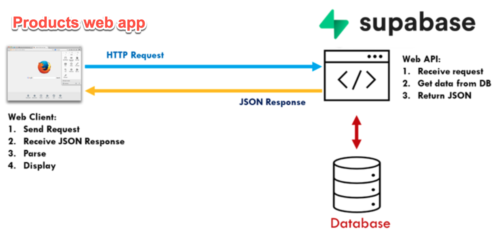
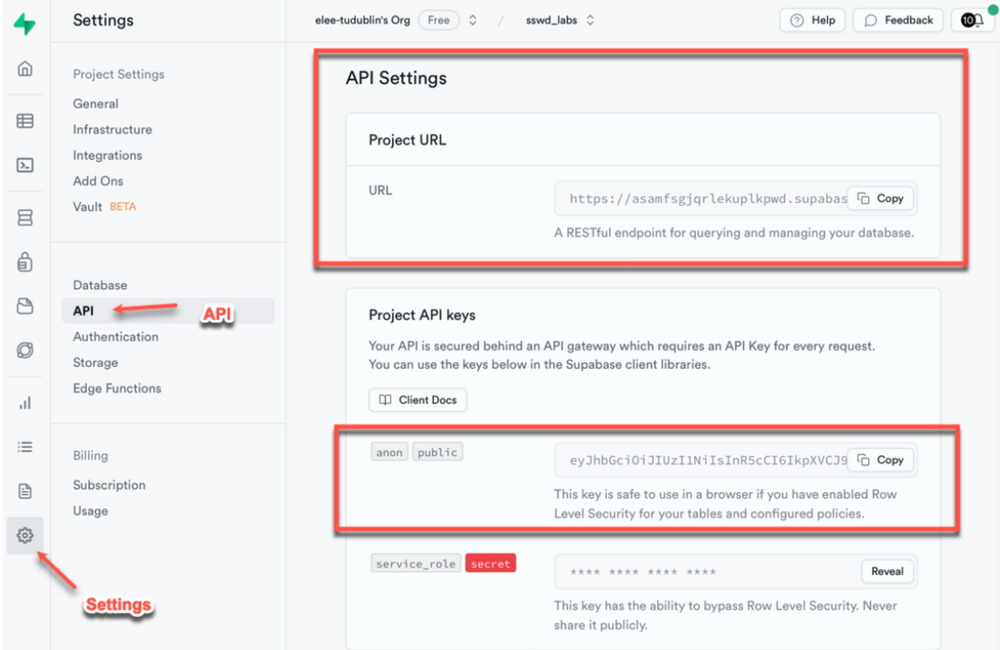
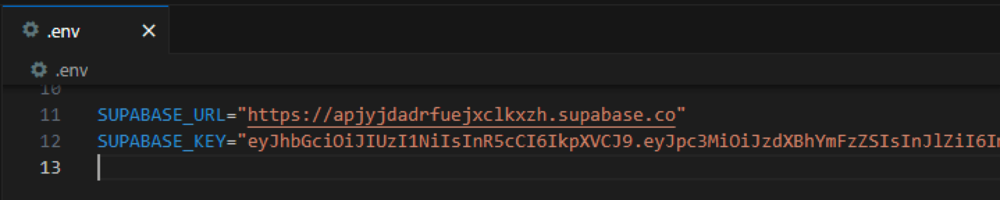
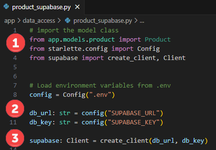
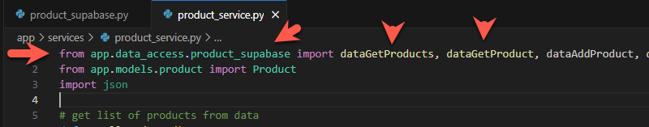
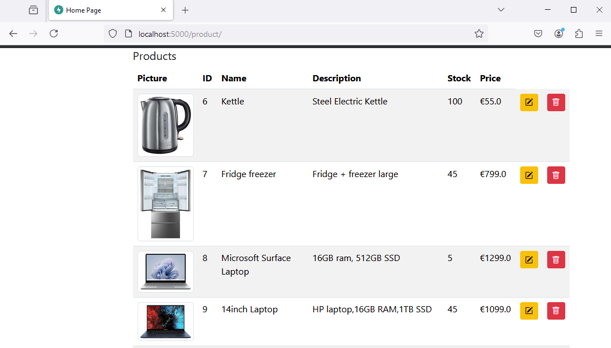

# Lab 8: Using a Supabase DB in the Products Web App


## Introduction

This lab modifies the completed Products example to use a sup abase database.



[Supabase Python Documentation](https://supabase.com/docs/reference/python/introduction)

### Getting started

**Start by cloning this repository and opening in VS Code.**

1. Configure the Python Virtual Environment

   `python -m venv venv --prompt="lab8"`

2. Activate the Virtual Environment

   `venv\Scripts\activate`

3. Install dependencies (note addition of `supabase`)

   `pip install fastapi uvicorn jinja2 python-multipart httpx supabase`

4. Setup the `.env` file, e.g. based on `.env.example`

5. To run the application

   `uvicorn app.main:app --reload --port=5000`


## 1. Configure the app to use Supabase

In order to connect, the database URL and **public** API key are required. These can be obtained from your Supabase project settings and are unique to your database.



These values should be saved in the **`.env`** file



The `supabase` dependency is also required. This was included above, but can be installed separately using **`pip install supabase`**


## 2. Get data and display

Next we will use supabase in place of the exiting 'fake' database list of products.

Add a new file **`product_supbase.py`** to `app/data_access`. This will serve as the data access layer.

The Supabase Python guide is a good reference for how to connect and query the database.

#### Connect to the DB

1. First import the required dependencies including the supabase functions required to make a connection to the service.

2. Read the database url and API key from the `.env` files
3. Define a supabase client instance (named **supabase**)



#### Get data from the `product` table

1. Get all products

2. Get a product by id

   

**`app/data_access/product_sapabase.py`**

```python
# import the model class
from app.models.product import Product
from starlette.config import Config
from supabase import create_client, Client


# Load environment variables from .env
config = Config(".env")

db_url: str = config("SUPABASE_URL")
db_key: str = config("SUPABASE_KEY")

supabase: Client = create_client(db_url, db_key)


# get all products
def dataGetProducts():
    response = supabase.table("product").select("*").execute()
    return response.data

# get product by id
def dataGetProduct(id):
    # select * from product where id = id 
    response = supabase.table("product").select("*").eq("id", id).execute()
    return response.data

```


#### Update `product_service.py` to use the database

As the application was designed with separate layers, it can be easily updates to use the new database functionality.

Open **`app/service/product_service.py`** and change the first import to use `app.data_access.product_supbase`



Note:

1. This works because the same function names were used
2. Only two of the data functions are defined at this point so no everything will work.

#### Try the application

The product data should be displayed, from Supabase. The images are served from the `/static/images/products` folder. 




## Exercices

1. Display a list of categories on the left side of the page.
2. Referring to the Supabase Python Reference, complete the add, edit, and delete functions for product.
3. 
